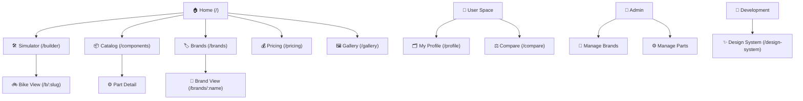

# 🗺️ Site Map & Design System Specification

Este documento serve como a fonte de verdade para a estrutura, navegação e identidade visual do projeto **Bicicleta**. Ele foi desenhado para ser importado por IAs de design (como o Claude Design) para gerar interfaces coerentes e funcionais.

---

## 1. 🏗️ Arquitetura de Informação (Site Map)

A aplicação é um monólito Nuxt.js focado em customização e catálogo de bicicletas de alta performance.

### Mapa Visual (Mermaid)



### Detalhamento das Rotas

| Rota | Descrição | Componentes Chave |
| :--- | :--- | :--- |
| `/` | Landing page com proposta de valor e destaques. | `ProductGrid`, `Hero` |
| `/builder` | Interface principal de montagem de bikes. | `MiniBuilder`, `TierSelector` |
| `/components` | Catálogo filtrável de peças (transmissão, suspensão, etc). | `ProductCard`, `CategorySidebar` |
| `/brands` | Índice de marcas parceiras e fabricantes. | `BrandMindmap` |
| `/b/:slug` | Visualização 360º/Detalhada de uma montagem específica. | `BikeDetailView`, `ShareBikeModal` |
| `/compare` | Comparador lado-a-lado de specs técnicas. | `ComparisonTable` |
| `/profile` | Dashboard do usuário com suas montagens salvas. | `GroupGrid`, `SaveBikeModal` |
| `/pricing` | Planos de assinatura e serviços premium. | `PricingTable` |

---

## 2. 🎨 Design System Tokens

Tokens extraídos da configuração atual (`themes.config.ts`). Estes valores devem ser usados para garantir consistência em todos os componentes.

### JSON de Temas (Copy-Paste)

```json
{
  "project": "Bicicleta",
  "version": "1.0.0",
  "themes": [
    {
      "id": "daniel-builds",
      "name": "Daniel Builds",
      "vibe": "Editorial Moderno",
      "colors": {
        "background": "#f4f0e8",
        "primary": "#0d6b6b",
        "secondary": "#4a5058"
      },
      "audience": "Profissionais ciclistas, MTB premium"
    },
    {
      "id": "sport-tech",
      "name": "Sport-Tech",
      "vibe": "Premium Dark Tech",
      "colors": {
        "background": "#0E1219",
        "primary": "#06B6D4",
        "secondary": "#0EA5E9"
      },
      "audience": "Tech-savvy, moderno"
    },
    {
      "id": "brutalist",
      "name": "Brutalist",
      "vibe": "Raw & Bold",
      "colors": {
        "background": "#000000",
        "primary": "#FFFFFF",
        "secondary": "#EF4444"
      },
      "audience": "Designers, Anti-design"
    },
    {
      "id": "retro-futurism",
      "name": "Retro-Futurism",
      "vibe": "Cyberpunk / 80s",
      "colors": {
        "background": "#0F0524",
        "primary": "#FF00FF",
        "secondary": "#00FFFF"
      },
      "audience": "Gamers, Alternativos"
    }
  ],
  "typography": {
    "display": "Black / Tracking Tighter",
    "body": "Inter / System Sans"
  },
  "ui_preferences": {
    "borders": "2px Black (Brutalist style)",
    "shadows": "Hard shadows [2px_2px_0px_0px_rgba(0,0,0,1)]",
    "radius": "0 (Sharp corners preferred)"
  }
}
```

---

## 3. 🧩 Inventário de Componentes

Componentes reutilizáveis que formam o ecossistema visual da Bicicleta.

| Componente | Função | Contexto de Uso |
| :--- | :--- | :--- |
| `BikeDetailView` | Exibe specs completas e render da bike. | Página `/b/:slug` |
| `ProductCard` | Card de peça individual com preço e marca. | Catálogo e Builder |
| `BrandMindmap` | Visualização relacional de marcas. | Página `/brands` |
| `MiniBuilder` | Widget de seleção rápida de peças. | Home e Builder |
| `ThemeSelector` | Toggle global de temas do sistema. | Header / Design System |
| `TierSelector` | Filtro de nível de performance (Entry/Mid/Pro). | Builder |
| `OfflineBanner` | Aviso de estado de conexão. | Global (`app.vue`) |

---

## 4. 🚀 Instruções para o Claude Design

Ao usar este documento no Claude Design, utilize o seguinte prompt:

> "Use o **Site Map & Design System Specification** em anexo para criar uma interface [Página Desejada] para o projeto Bicicleta. Siga estritamente os **Design Tokens** (especialmente o tema escolhido) e garanta que os componentes respeitem as **ui_preferences** (bordas pretas de 2px, sombras sólidas e cantos vivos). A navegação deve seguir a hierarquia do **Mapa de Arquitetura**."
